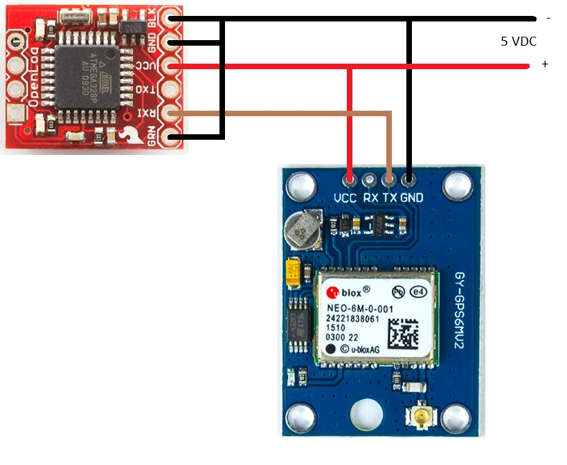

# OpenLog GPS com Neo-6m
<p align="center">
  
</p>

## Objectivo
Criar um modo simples de usar um GPS e guardar a posição dos locais onde passamos.

## Hardware
Usa o datalogger da Sparkfun (https://github.com/sparkfun/OpenLog/tree/master) e um módulo GPS da u-blox, o Neo-6m (https://www.u-blox.com/en/product/neo-6-series).

O datalogger da Sparkfun é um módulo muito compacto (podia ser menos compacto e dar acesso fácil a alguns I/O disponíveis) que permite registar num cartão SD os dados recebidos no pino RX.
Tem diferentes modos de funcionamento, mas nenhum deles está habilitado a fazer parser dos dados recebidos.

O GPS Neo-6m da u-blox, é muito popular pela utilização simples. Basta ligar e usar a céu aberto que ele propaga tramas NMEA no pino TX (e pelas outras interfaces também, 
apesar de nem todos os módulos à venda as disponibilizarem, por exemplo, usei, **em simultâneo**, a interface USB ligada a um PC com o software u-center, https://www.u-blox.com/en/product/u-center, e o 
pino TX ligado a um Arduino Uno).

## Software

Ligando o pino TX do GPS ao pino RX do datalogger e escolhendo o Modo Rotate, este regista tudo o que se lhe enviar. 
Acontece que as tramas NMEA não são de leitura fácil para humanos, nem o registo das mesmas é simples de utilizar sem uma referência temporal.

O Neo-6m envia, a cada segundo, tramas cujo conteúdo depende do estado de sincronismo em que se encontra:

Após ligar e não sincronizado:
```
15:25:22  $GPRMC,,V,,,,,,,,,,N*53
15:25:22  $GPVTG,,,,,,,,,N*30
15:25:22  $GPGGA,,,,,,0,00,99.99,,,,,,*48
15:25:22  $GPGSA,A,1,,,,,,,,,,,,,99.99,99.99,99.99*30
15:25:22  $GPGSV,1,1,01,24,,,33*7E
15:25:22  $GPGLL,,,,,,V,N*64
```

Já com sinal suficiente para enviar hora/data:
```
15:31:57  $GPRMC,153157.00,V,,,,,,,051125,,,N*7B
15:31:57  $GPVTG,,,,,,,,,N*30
15:31:57  $GPGGA,153157.00,,,,,0,00,99.99,,,,,,*62
15:31:57  $GPGSA,A,1,,,,,,,,,,,,,99.99,99.99,99.99*30
15:31:57  $GPGSV,1,1,01,24,,,28*74
15:31:57  $GPGLL,,,,,153157.00,V,N*4E
```

E sincronizado, enviando também as coordenadas, velocidade, altura, rumo, ...:
```
16:16:29  $GPRMC,161629.00,A,3828.22358,N,00849.99768,W,3.805,,051125,,,A*4F
16:16:29  $GPVTG,,T,,M,3.805,N,7.048,K,A*26
16:16:29  $GPGGA,161629.00,3857.22358,N,00859.99768,W,1,04,14.33,100.7,M,48.5,M,,*71
16:16:29  $GPGSA,A,3,06,11,12,24,,,,,,,,,17.05,14.33,9.23*0F
16:16:29  $GPGSV,3,1,09,06,06,047,18,10,07,243,,11,10,085,30,12,55,042,17*77
16:16:29  $GPGSV,3,2,09,24,34,112,30,25,74,318,,28,25,304,19,29,39,176,11*7C
16:16:29  $GPGSV,3,3,09,32,52,285,20*4B
16:16:29  $GPGLL,3857.22358,N,00859.99768,W,161629.00,A,A*7A
```

Se registarmos as tramas sem qualquer tipo de filtro, guardamos muita coisa que não faz falta e, sem forma de saber onde estão os dados, é mais complicado usufruir deles.

Assim, usei o software disponibilizado pela Sparkfun (https://github.com/sparkfun/OpenLog/tree/master/firmware/OpenLog_Firmware/OpenLog), acrescentei um novo modo de funcionamento, MODE_GPS, 
fiz parsing à trama $GPRCM e guardei apenas os dados mais utilizados.
A trama $GPRCM tem 3 tipos de formato:

Não sincronizado:
```
	$GPRMC,,V,,,,,,,,,,N*53
```

Com hora/data:
```
	$GPRMC,153157.00,V,,,,,,,051125,,,N*7B
```

E sincronizado:
```
$GPRMC,161629.00,A,3855.22358,N,00849.99768,W,3.805,,051125,,,A*5F
		  |		 |     |      |     |       |   |       |
		  |		 |     |      |     |       |   |       - data
		  |		 |     |      |     |       |   - velocidade       
		  |		 |     |      |     |       - Este/Oeste   
		  |		 |     |      |     - latitude
		  |		 |     |      - Norte/Sul
		  |		 |     - longitude
		  |		 - sinc. (A)/ não sinc. (V)     
		  - hora     
```
Deste último formato podem retirar-se a hora, a longitude, a latitude, a data e a velocidade, mais do que suficiente para a maior parte das aplicações.

Os dados são guardados no cartão SD a cada minuto, num ficheiro de texto cujo nome é a data em que foram obtidos e apenas o GPS estiver sincronizado. 

A data foi manipulada de modo a aparecer como AAMMDD, para ser mais fácil de ordenar.

Os ficheiros guardados têm linhas com a hora, a longitude e a latitude, já convertidas para graus e a velocidade em km/h, por exemplo:

```
14:35:00; 38.71690; -9.13983; 0.740;
14:36:00; 38.71664; -9.14000; 0.926;
14:37:00; 38.71674; -9.14010; 0.740;
14:38:00; 38.71685; -9.13996; 1.111;
```

O programa original da Sparkfun mantêm-se tal como estava, apenas com esta funcionalidade acrescentada (MODE_GPS).
Quando o programa inicia, procura pelo ficheiro de configuração, "config.txt", e, se não existir, cria-o.
O conteúdo do ficheiro de configuração é:
´´´
9600,36,3,4,1,1,0,100,100
baud,escape,esc#,mode,verb,echo,ignoreRX,maxFilesize,maxFilenum
´´´
As diferenças para o ficheiro original são:
´´´
O caracter de escape para entrar no modo de configuração é o $ (36).
O modo de funcionamento é o MODE_GPS (4).
´´´

De seguida, cria o ficheiro "dummy.txt". Este ficheiro só é utilizado no inicio para que o programa não fique preso e entre no ciclo que espera dados válidos 
da trama $GPRMC ou 3 caracteres $ para entrar em modo de configuração.
A partir daqui, fica a aguardar dados válidos e escreve-os, a cada minuto, num ficheiro de texto cujo nome é a data em que foram adquiridos.

# Ligações

Para programar o datalogger usa-se um conversor USB/TTL, tipo FTDI, ou semelhante.

Ver https://learn.sparkfun.com/tutorials/openlog-hookup-guide/all

<p align="center">
  
</p>


Para ligar o GPS ao datalogger a ligação entre os módulos deve ser cruzada, ou seja, o pino TX do GPS liga ao pino RX do datalogger.
O pino RX do GPS deve ficar sem ligação (não é necessário). 

É de bom tom recorsdar que o Neo-6m não é tolerante a 5 V. 

<p align="center">
  
</p>


A maior parte dos módulos que estão no mercado têm um regulador de tensão que permite alimentação de 5 VDC, no entanto, é sempre bom verificar.


$
